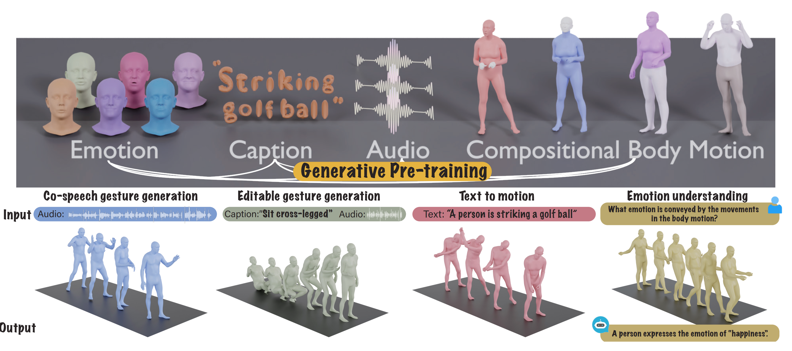

# The Language of Motion

[](https://arxiv.org/pdf/2412.10523)
[](https://languageofmotion.github.io/)


This repository contains the official implementation of "The Language of Motion:
Unifying Verbal and Non-verbal Language of 3D Human Motion".

## 🔍 Overview

Language of Motion (LoM) is a framework that models human motion generation as a sequence modeling problem using language models. It decomposes the human body into separate regions (face, hands, upper, and lower body) to effectively capture and generate natural human movements from various modalities such as text and audio.




## ✅ TODO List
- [x] Initial code release
- [x] Inference code
- [ ] Tokenizer training code
- [ ] AMASS and LibriSpeech preprocessing code
- [ ] Evaluation Benchmark results
- [ ] Text-to-motion Result on rotation format

<!-- - [x] Document training pipeline
- [ ] Add pretrained model downloads
- [ ] Provide comprehensive installation instructions
- [ ] Add evaluation scripts
- [ ] Create interactive demo notebook
- [ ] Document dataset preparation process
- [ ] Add visualization tools -->

## 🛠️ Environment Setup

We use Conda for environment management. Follow these steps to set up the development environment:

```bash
# Create and activate the conda environment
conda create --name lom_release -y python=3.10
conda activate lom_release

# Install PyTorch with CUDA support
conda install pytorch==2.4.0 torchvision torchaudio pytorch-cuda=12.1 -c pytorch -c nvidia


# Install dependencies
pip install -r requirements.txt

# Install additional packages
pip install turbot5 -U
python -m spacy download en_core_web_sm

# Set up fairseq (required for some components)
cd third_party
git clone https://github.com/pytorch/fairseq
cd fairseq
pip install --editable ./
cd ../..
```

For rendering, we refer the [TEMOS](https://github.com/Mathux/TEMOS) as following step to install:

```bash
wget 'https://download.blender.org/release/Blender2.93/blender-2.93.18-linux-x64.tar.xz' -O './third_party/blender-2.93.18-linux-x64.tar.xz'

tar -xf ./third_party/blender-2.93.18-linux-x64.tar.xz -C ./third_party/


## Double check the blender path
./third_party/blender-2.93.18-linux-x64/blender --background --python-expr "import sys; import os; print('\nThe path to the installation of python of blender can be:'); print('\n'.join(['- '+x.replace('/lib/python', '/bin/python') for x in sys.path if 'python' in (file:=os.path.split(x)[-1]) and not file.endswith('.zip')]))"

./third_party/blender-2.93.18-linux-x64/2.93/python/bin/python3.9 -m ensurepip --upgrade
./third_party/blender-2.93.18-linux-x64/2.93/python/bin/python3.9 -m pip install --upgrade pip
./third_party/blender-2.93.18-linux-x64/2.93/python/bin/python3.9 -m pip install --user numpy
./third_party/blender-2.93.18-linux-x64/2.93/python/bin/python3.9 -m pip install --user matplotlib
./third_party/blender-2.93.18-linux-x64/2.93/python/bin/python3.9 -m pip install --user hydra-core --upgrade
./third_party/blender-2.93.18-linux-x64/2.93/python/bin/python3.9 -m pip install --user moviepy
./third_party/blender-2.93.18-linux-x64/2.93/python/bin/python3.9 -m pip install --user shortuuid
# ./third_party/blender-2.93.18-linux-x64/2.93/python/bin/python3.9 -m pip install --target=./third_party/blender-2.93.18-linux-x64/2.93/python/lib/python3.9/site-packages natsort
./third_party/blender-2.93.18-linux-x64/2.93/python/bin/python3.9 -m pip install -r model_files/requirements_render.txt

./third_party/blender-2.93.18-linux-x64/2.93/python/bin/python3.9 -m pip install moviepy
# ./third_party/blender-2.93.18-linux-x64/2.93/python/bin/python3.9 -m pip install --target=./third_party/blender-2.93.18-linux-x64/2.93/python/lib/python3.9/site-packages moviepy

# ./third_party/blender-2.93.18-linux-x64/2.93/python/bin/python3.9 -m pip install omegaconf==2.1.0


./third_party/blender-2.93.18-linux-x64/2.93/python/bin/python3.9 -m pip install --upgrade --force-reinstall --no-cache-dir --target=./third_party/blender-2.93.18-linux-x64/2.93/python/lib/python3.9/site-packages moviepy


```


## Required Resources
Please register an account on the [Max Planck Institute for Intelligent Systems (MPI-IS) website](https://smpl-x.is.tue.mpg.de/index.html) to access the necessary SMPLX models. Then download the SMPLX models, Hubert, T5, and T2M metrics computation checkpoints by running the following script:

```bash
chmod +x build_resources.sh
./build_resources.sh
```

After running the script, you will have the following directory structure:
```
model_files/
├── hubert_models/     # Hubert audio tokenizer models
├── smplx_models/      # SMPLX body models
├── t2m_evaluators/    # Text-to-Motion evaluation metrics
└── t5_models/         # T5 language models
```


## Quick Start

```bash
python -m train --cfg configs/config_mixed_stage2.yaml --nodebug
```


## Data Preparation

To train the model, you will need to download the following datasets:

1. **AMASS**: Human motion dataset from [AMASS website](https://amass.is.tue.mpg.de/), with text annotation from [HumanML3D](https://github.com/EricGuo5513/HumanML3D).
2. **BEAT2**: Co-speech gesture dataset containing synchronized speech, emotion label, and motion data, available from the [BEAT website](https://drive.google.com/drive/folders/1ukbifhHc85qWTzspEgvAxCXwn9mK4ifr).
3. **LibriSpeech**: Large-scale (1000+ hours) corpus of read English speech, downloadable from the [LibriSpeech website](https://www.openslr.org/12).

After downloading, organize the datasets according to the following structure (detailed preprocessing instructions will be provided soon):

```
datasets/
├── AMASS/
├── BEAT2/
    ├── beat_chinese_v2.0.0/
    ├── beat_english_v2.0.0/
    ├── beat_japanese_v2.0.0/
    ├── beat_spanish_v2.0.0/
└── LibriSpeech/
```

## Training Pipeline

Our training process consists of three progressive stages:

### 1️⃣ Compositional Motion Tokenization (VQ-VAE Training)

First, we train VQ-VAE models to extract compositional body codes for different body parts. Note: This implementation builds upon the excellent work from [EMAGE](https://github.com/PantoMatrix/PantoMatrix/tree/main):

```bash
# Face
python -m train --cfg configs/config_mixed_stage1_vq_face.yaml --nodebug

# Hands
python -m train --cfg configs/config_mixed_stage1_vq_hand.yaml --nodebug

# Upper Body
python -m train --cfg configs/config_mixed_stage1_vq_upper.yaml --nodebug

# Lower Body
python -m train --cfg configs/config_mixed_stage1_vq_lower.yaml --nodebug

# Global Location
python -m train --cfg configs/config_mixed_stage1_vq_global.yaml --nodebug

```

### 2️⃣ Pretraining Stage

This stage trains the main language model that coordinates all body parts:

```bash
python -m train --cfg configs/config_mixed_stage2.yaml --nodebug
```

### 3️⃣ Task-Specific Fine-tuning Stage

Fine-tune the model for specific tasks:

```bash
# Co-speech Gesture Generation
python -m train --cfg configs/config_mixed_stage3.yaml --nodebug --task a2m

# Text-to-Motion Generation
python -m train --cfg configs/config_mixed_stage3.yaml --nodebug --task t2m

# Emotion Understanding
python -m train --cfg configs/config_mixed_stage3.yaml --nodebug --task e2m

# Multi-task Fine-tuning
python -m train --cfg configs/config_mixed_stage3.yaml --nodebug --task all
```

## 📦 Pretrained Models

Pretrained models will be available soon. Stay tuned for updates!

## 📝 Citation

If you find our work useful for your research, please consider citing:

```bibtex
@article{chen2024language,
  title={The Language of Motion: Unifying Verbal and Non-verbal Language of 3D Human Motion},
  author={Chen, Changan and Zhang, Juze and Lakshmikanth, Shrinidhi K and Fang, Yusu and Shao, Ruizhi and Wetzstein, Gordon and Fei-Fei, Li and Adeli, Ehsan},
  journal={arXiv preprint arXiv:2412.10523},
  year={2024}
}
```

## 🙏 Acknowledgements

This project was partially funded by NIH grant R01AG089169 and UST. The authors would also like to thank Georgios Pavlakos for his valuable discussion, Chaitanya Patel, Jingyan Zhang, and Bin Li for their feedback on the paper.
