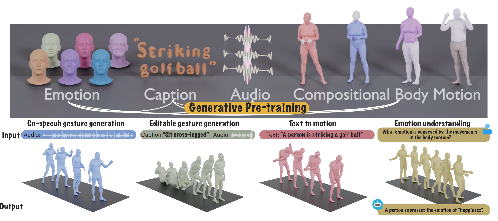

# The Language of Motion

[](https://arxiv.org/pdf/2412.10523)
[](https://languageofmotion.github.io/)

This repository contains the official implementation of "The Language of Motion: Unifying Verbal and Non-verbal Language of 3D Human Motion".

## 🔍 Overview

Language of Motion (LoM) is a framework that models human motion generation as a sequence modeling problem using language models. It decomposes the human body into separate regions (face, hands, upper, and lower body) to effectively capture and generate natural human movements from various modalities such as text and audio.



## ✅ TODO List

- [x] Initial code release
- [x] Inference code for text-to-motion
- [x] Inference code for co-speech gesture generation
- [x] Tokenizer training code
- [x] AMASS and LibriSpeech preprocessing code
- [ ] Evaluation Benchmark results — **ETA:** Next week
- [ ] Text-to-motion Result on rotation format
- [ ] Language model training code

## 🛠️ Environment Setup

We use Conda for environment management. Follow these steps to set up the development environment:

```bash
# Create and activate the conda environment
conda create --name lom -y python=3.10
conda activate lom

# Install PyTorch with CUDA support
conda install pytorch==2.4.0 torchvision torchaudio pytorch-cuda=12.1 -c pytorch -c nvidia
# Alternative for RTX 5090 users: install pytorch by following way
# pip install --pre torch torchvision torchaudio --index-url https://download.pytorch.org/whl/nightly/cu128

# Install pip and dependencies
python -m pip install pip==21.3
pip install -r requirements.txt

# Install additional packages
pip install turbot5 -U
# Alternative for RTX 5090 users: upgrade triton to support the new architecture
# pip install --upgrade "git+https://github.com/openai/triton.git@main#egg=triton&subdirectory=python"
# export TRITON_JIT_CUDA_ARCHITECTURES=$(
#   python - <<'EOF'
# import torch
# p = torch.cuda.get_device_properties(0)
# print(f"{p.major}{p.minor}")
# EOF
# )

# Install NLP tools
python -m spacy download en_core_web_sm

# Set up fairseq (required for some components)
mkdir -p third_party
cd third_party
git clone https://github.com/pytorch/fairseq
cd fairseq
pip install --editable ./
cd ../..
```

### Setting Up Blender for Rendering

We use [TEMOS](https://github.com/Mathux/TEMOS) for rendering. Install it with our provided script:

```bash
# Execute the setup script to install Blender and its dependencies
chmod +x setup_blender.sh
./setup_blender.sh
```

This script will:
1. Download and extract Blender 2.93.18
2. Verify the Blender Python path
3. Install all necessary Python packages for rendering

## 📥 Required Resources

Please register an account on the [Max Planck Institute for Intelligent Systems (MPI-IS) website](https://smpl-x.is.tue.mpg.de/index.html) to access the necessary SMPLX models. Then download the SMPLX models, Hubert, T5, and T2M metrics computation checkpoints by running the following script:

```bash
chmod +x build_resources.sh
./build_resources.sh
```

After running the script, you will have the following directory structure:
```
model_files/
├── hubert_models/     # Hubert audio tokenizer models
├── smplx_models/      # SMPLX body models
├── t2m_evaluators/    # Text-to-Motion evaluation metrics
└── t5_models/         # T5 language models
```

## 📦 Pretrained Models

Pretrained models are gradually uploading! Visit the [Hugging Face](https://huggingface.co/JuzeZhang/language_of_motion) repository to download them.

## 🚀 Quick Start

### Text-to-Motion Generation
```bash
python demo.py --cfg configs/demo_text2motion.yaml --text examples/text2motion.txt --task text2motion --render
```
### Co-speech Gesture Generation
```bash
python demo.py --cfg configs/demo_cospeech.yaml --audio examples/2_scott_0_111_111.wav --task cospeech --render
```
After running the demo scripts, the generated motion results (including rendered videos and motion data) will be saved in the `./results` directory. For text-to-motion generation, you'll find the motion sequences in `.npz` format and rendered videos in `.mp4` format. For co-speech gesture generation, the results will include synchronized motion and audio in a single video file.

## 🗃️ Data Preparation

For detailed instructions on data preparation and preprocessing, please refer to the [Datasets Guide](./preprocess/README.md).

## 🔄 Training Pipeline

Our comprehensive training documentation is coming soon! We'll provide detailed instructions for all three stages:
1. Compositional Motion Tokenization (VQ-VAE Training)
2. Language Model Pretraining
3. Task-Specific Fine-tuning

Stay tuned for updates on our training procedures and best practices.

## Evaluation

Evaluation metrics and benchmarking result are currently being prepared. Soon, we'll provide:
- Standardized evaluation scripts for all supported tasks
- Benchmark results on public datasets
- Comparison with SOTA methods

Check back for updates or follow our GitHub repository for notifications.

## 📝 Citation

If you find our work useful for your research, please consider citing:

```bibtex
@article{chen2024language,
  title={The Language of Motion: Unifying Verbal and Non-verbal Language of 3D Human Motion},
  author={Chen, Changan and Zhang, Juze and Lakshmikanth, Shrinidhi K and Fang, Yusu and Shao, Ruizhi and Wetzstein, Gordon and Fei-Fei, Li and Adeli, Ehsan},
  journal={CVPR},
  year={2025}
}
```

## Acknowledgements

This project was partially funded by NIH grant R01AG089169 and UST. The authors would also like to thank Georgios Pavlakos for his valuable discussion, Chaitanya Patel, Jingyan Zhang, and Bin Li for their feedback on the paper.
